# Frave Social - Social Media

Frave Developer

### Youtube Channel

[Frave Developer](https://cutt.ly/pckBg9D)

### Video Yotube

[Flutter - Social Media App | Nodejs and Mysql | Flutter Project](https://youtu.be/QurHn2Bno7I)

### Social Media

<a href="https://www.instagram.com/frave_developer"></a>

### Donate

<a href="https://www.buymeacoffee.com/frave"></a>


## Requirements

- Change IP
    - lib/services/url_service.dart

## Flutter

- Flutter bloc
- Socket io client
- http

```sh
    flutter pub upgrade
```

```
    flutter pub get
```

## Backend

- [Node.Js](https://github.com/Frave07/Social-Media-Backend)

---

## Screenshots

<table border>
    <tr>
        <th style="text-align:center">Home</th>
        <th style="text-align:center">Story</th>
        <th style="text-align:center">Search</th>
    </tr>
    <tr>
        <td>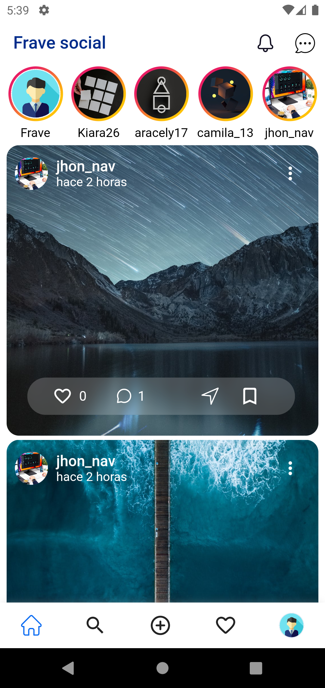</td>
        <td></td>
        <td></td>
    <tr>
</table>

<table border>
    <tr>
        <th style="text-align:center">Search | view Photo</th>
        <th style="text-align:center">Search User</th>
        <th style="text-align:center">Profile another user</th>
    </tr>
    <tr>
        <td></td>
        <td></td>
        <td></td>
    <tr>
</table>

<table border>
    <tr>
        <th style="text-align:center">Add New post</th>
        <th style="text-align:center">Add new Post</th>
        <th style="text-align:center">Privacy post</th>
    </tr>
    <tr>
        <td>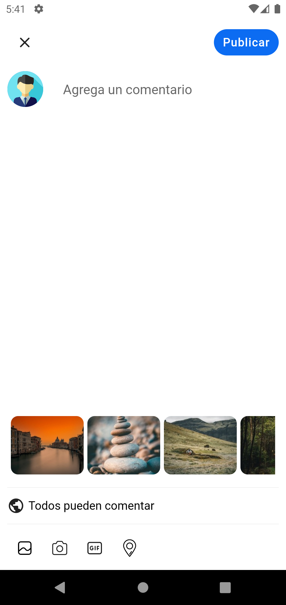</td>
        <td></td>
        <td>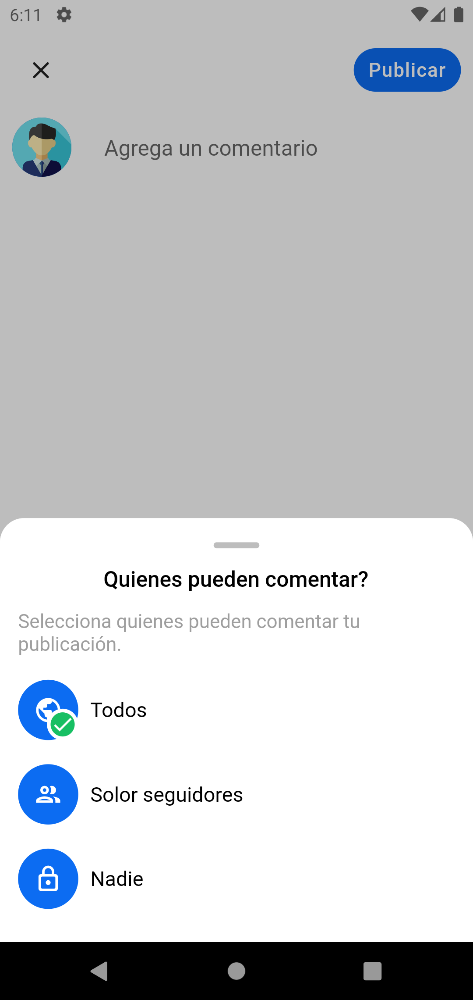</td>
    <tr>
</table>

<table border>
    <tr>
        <th style="text-align:center">Activity</th>
        <th style="text-align:center">Profile</th>
        <th style="text-align:center">Profile - Saved</th>
    </tr>
    <tr>
        <td>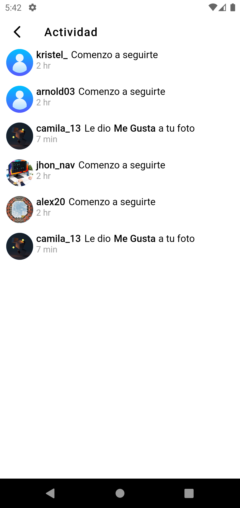</td>
        <td>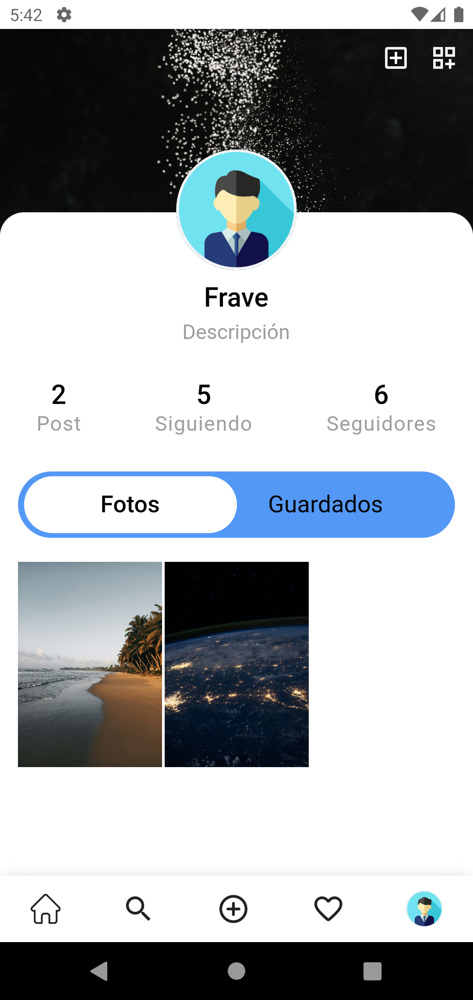</td>
        <td>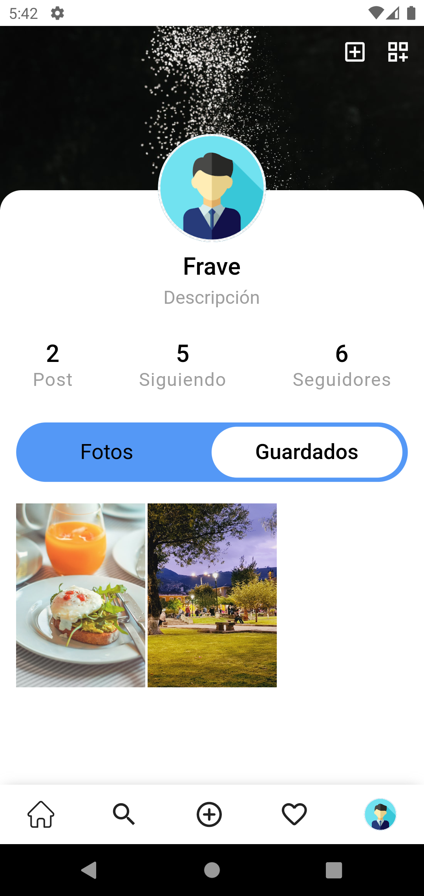</td>
    <tr>
</table>

<table border>
    <tr>
        <th style="text-align:center">Following</th>
        <th style="text-align:center">Followers</th>
        <th style="text-align:center">Modal Settings</th>
    </tr>
    <tr>
        <td>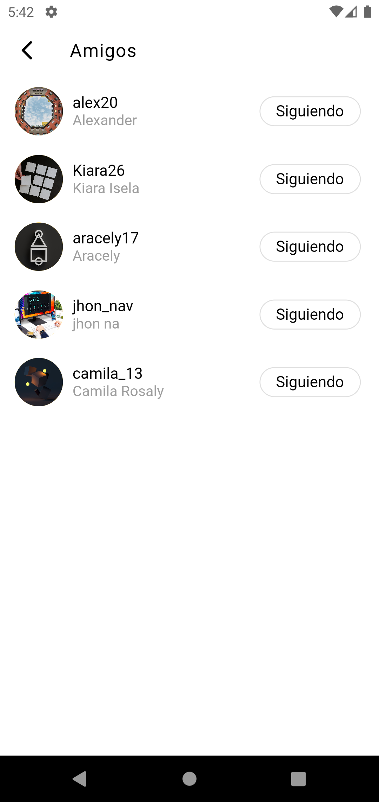</td>
        <td>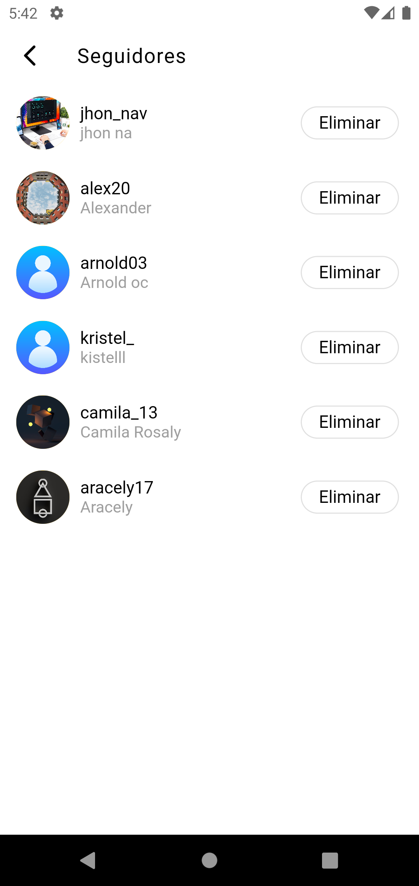</td>
        <td>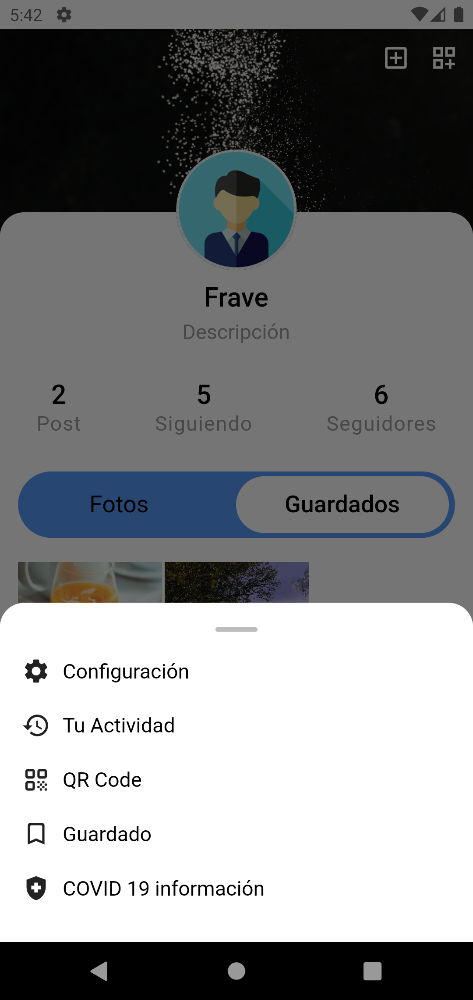</td>
    <tr>
</table>

<table border>
    <tr>
        <th style="text-align:center">Settings</th>
        <th style="text-align:center">Privacy</th>
        <th style="text-align:center">Security</th>
    </tr>
    <tr>
        <td>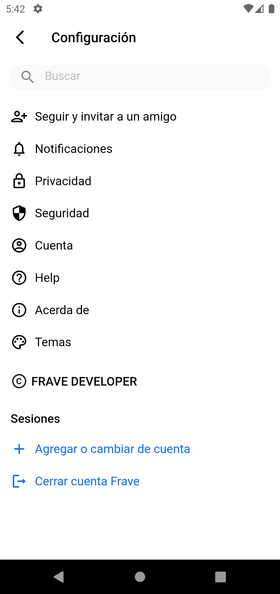</td>
        <td>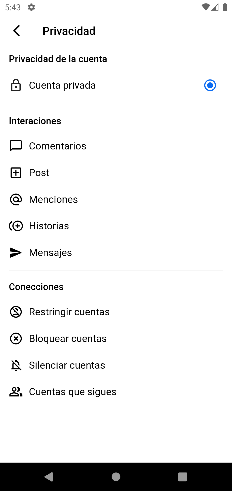</td>
        <td>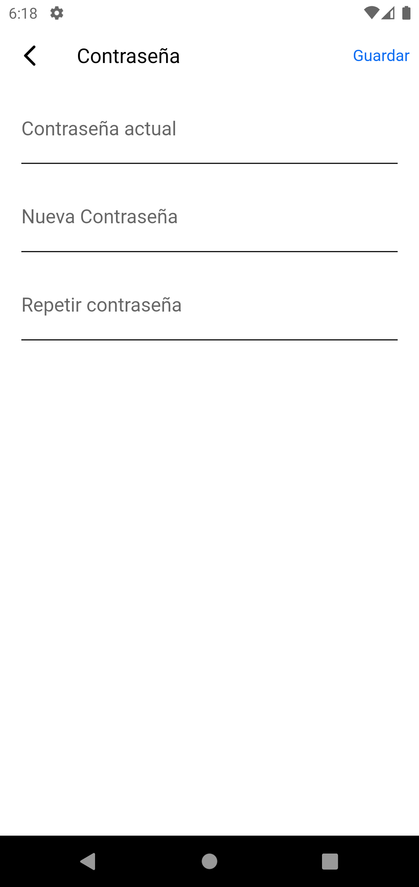</td>
    <tr>
</table>

<table border>
    <tr>
        <th style="text-align:center">Account</th>
        <th style="text-align:center">List Messages</th>
        <th style="text-align:center">Chat</th>
    </tr>
    <tr>
        <td>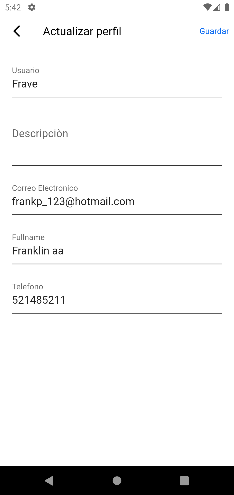</td>
        <td>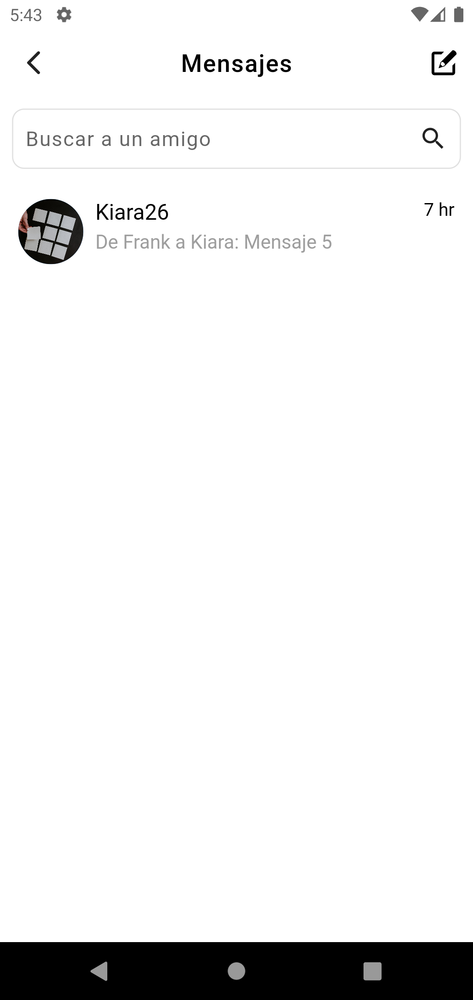</td>
        <td>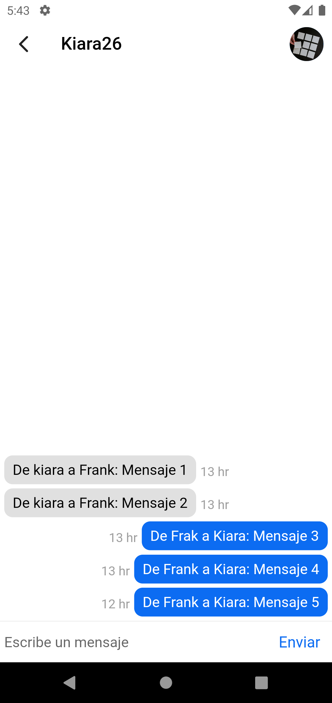</td>
    <tr>
</table>